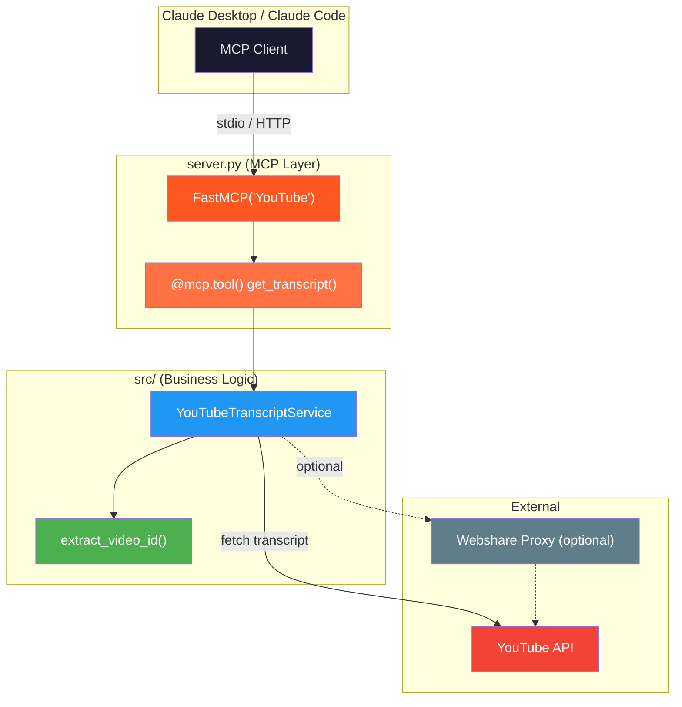

# 🎬 YouTube MCP Server — Codebase Walkthrough

## The Big Picture

This is a **real-world MCP server** that exposes a single tool — `get_transcript` — allowing an LLM (via Claude Desktop or Claude Code) to fetch the transcript of any YouTube video. It's a clean, small project (~110 lines total) that demonstrates how production MCP servers are structured.

---

## Recommended Reading Order: **Bottom-Up** 🔽➡️🔼

The best way to understand this codebase is **bottom-up** — start with the smallest utility, build up to the business logic, then see how MCP wraps it all.


---

## File-by-File Breakdown

### 1️⃣ Start here → [utils.py](file:///c:/Users/ashutoshb/ML_Practice/MCP/servers/youtube/src/utils.py) *(16 lines)*

**What it does:** A single pure function — `extract_video_id()` — that parses a YouTube URL (or raw ID) and returns just the 11-character video ID.

**Why read first:** It has **zero MCP knowledge**. It's just a regex helper. Understanding this first means you won't be distracted by it when you hit `service.py`.

**Key detail:** It handles 3 URL formats:
| Pattern | Example |
|---|---|
| `v=` parameter | `youtube.com/watch?v=dQw4w9WgXcQ` |
| `/embed/` path | `youtube.com/embed/dQw4w9WgXcQ` |
| Raw 11-char ID | `dQw4w9WgXcQ` |

---

### 2️⃣ Then → [service.py](file:///c:/Users/ashutoshb/ML_Practice/MCP/servers/youtube/src/service.py) *(54 lines)*

**What it does:** The `YouTubeTranscriptService` class — the **core business logic**. It wraps the `youtube-transcript-api` library to:
1. Optionally configure a Webshare proxy (for rate-limit avoidance)
2. Fetch a video's transcript via `self.api.fetch(video_id)`
3. Format it as plain text via `TextFormatter`

**Why read second:** This is still **pure Python with zero MCP code**. It's the "domain layer" — the actual useful work the server does. Notice how it imports `extract_video_id` from utils.

**Key design insight:** The service is designed to be **MCP-agnostic**. You could use this class in a Flask API, a CLI tool, or anywhere else. This separation is a best practice.

---

### 3️⃣ Then → [\_\_init\_\_.py](file:///c:/Users/ashutoshb/ML_Practice/MCP/servers/youtube/src/__init__.py) *(5 lines)*

**What it does:** Makes `src/` a Python package and re-exports the two key symbols:
- `YouTubeTranscriptService`
- `extract_video_id`

**Why read third:** It's the **glue**. It tells you "these are the public APIs of the `src` package." When `server.py` does `from src.service import YouTubeTranscriptService`, this is why it works cleanly.

---

### 4️⃣ The main event → [server.py](file:///c:/Users/ashutoshb/ML_Practice/MCP/servers/youtube/server.py) *(37 lines)*

**What it does:** This is **the MCP server itself**. Here's what each section means:

```python
# Lines 1-10: uv script metadata (dependency management)
# Lines 13-19: Create the MCP server instance
# Line 21:    Instantiate the YouTube service
# Lines 24-32: Register the "get_transcript" tool
# Lines 35-36: Run with stdio transport
```

**This is where your crash-course knowledge connects!**

| Crash Course Concept | Where You See It Here |
|---|---|
| `FastMCP()` server creation | Line 16-19 |
| `@mcp.tool()` decorator | Line 24 |
| Tool function with type hints | Lines 25-27 (the function signature becomes the tool's input schema!) |
| `mcp.run(transport="stdio")` | Line 36 |
| Error handling in tools | Lines 29-32 (return error string instead of crashing) |

**Key details:**
- The `uv` script header (lines 1-10) is a **`uv`-specific feature** — it lets `uv run server.py` auto-install all dependencies in an isolated env. This is how Claude Desktop launches the server.
- `stateless_http=True` on line 18 means the server can also work over HTTP (not just stdio).
- The tool returns a `str` — MCP tools should return serializable data.

---

### 5️⃣ Quick sanity check → [test.py](file:///c:/Users/ashutoshb/ML_Practice/MCP/servers/youtube/test.py) *(5 lines)*

**What it does:** A minimal smoke test — imports the tool function directly and calls it with a YouTube URL. No MCP protocol involved, just a direct Python function call.

**Why it exists:** Quick way to verify the YouTube API + transcript logic works before wiring it up to MCP. Notice it imports `get_transcript` from `server` — the `@mcp.tool()` decorated function is still a normal Python function you can call directly!

---

### 6️⃣ Finally → [README.md](file:///c:/Users/ashutoshb/ML_Practice/MCP/servers/youtube/README.md)

**What it does:** Step-by-step guide for:
1. Running the dev server (`mcp dev server.py`)
2. Testing with MCP Inspector
3. Configuring Claude Desktop
4. Configuring Claude Code CLI

Read this **last** because now you understand *what* each step is doing under the hood.

---

## Architecture Summary



## Data Flow (What happens when you ask Claude "summarize this video")

1. **Claude** sends a `tools/call` JSON-RPC request → `get_transcript("https://youtube.com/watch?v=xyz")`
2. **server.py** receives it, calls `_service.get_transcript_text("https://...")`
3. **service.py** calls `extract_video_id()` → gets `"xyz"`
4. **service.py** calls `self.api.fetch("xyz")` → gets raw transcript segments
5. **service.py** formats with `TextFormatter` → returns plain text string
6. **server.py** returns the string back to Claude via MCP
7. **Claude** uses the transcript to write you a summary

---

## Key Takeaways

> [!TIP]
> **The 3-layer pattern** — This is how well-structured MCP servers are built:
> 1. **Utils** (pure helpers, no dependencies)
> 2. **Service** (business logic, MCP-agnostic)
> 3. **Server** (thin MCP wrapper that just calls the service)

> [!IMPORTANT]
> The MCP server itself (`server.py`) is only **37 lines**. The real complexity lives in the domain logic (`service.py`). This is intentional — keep MCP glue thin, keep business logic reusable.

> [!NOTE]
> Compare this to your crash course: in the crash course you built tools inline. Here, the tool is just a **thin wrapper** around a service class. That's the production pattern — it keeps things testable and reusable.
